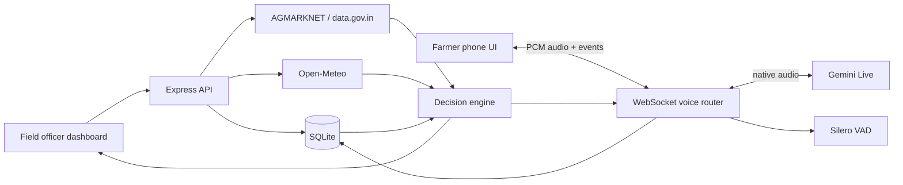

# AgriSell AI

**A local-first field intelligence and conversational voice system for farmer stock updates, mandi prices, weather risk and selling decisions.**

AgriSell gives an FPO or field officer one place to maintain farmer profiles, track multiple vegetables per farmer, review government wholesale prices, evaluate weather and storage risk, call a farmer through a browser-based phone experience, and save only explicitly confirmed stock updates.

The project currently targets a Nashik, Maharashtra pilot and supports English, Hindi and Marathi conversations.

> AgriSell is a decision-support pilot—not a guaranteed price predictor, buyer marketplace, financial adviser or replacement for an agronomist. AGMARKNET observations are published wholesale records, not guaranteed buyer quotes.

## What the system does

- Maintains one farmer profile with **multiple independent vegetable records**.
- Lets operators edit a farmer's name, phone, location, language and call consent.
- Tracks quantity, farmer-recorded price, maturity and safe-storage days per vegetable.
- Retrieves dated Nashik mandi observations from AGMARKNET/data.gov.in.
- Retrieves location-based forecasts from Open-Meteo.
- Produces transparent selling guidance from stock, storage, rain risk and available market evidence.
- Runs a continuous, hands-free Gemini Live voice conversation—no push-to-talk button.
- Speaks and transcribes through Gemini native audio.
- Uses local Silero voice activity detection to reject noise and detect when the farmer has finished speaking.
- Reads proposed stock values back and requires an explicit confirmation before writing to SQLite.
- Updates the dashboard and sends a clean in-app Messages-style receipt after a call.
- Supports follow-up messaging for stock collection and sourced advice.
- Preserves call history, messages, recommendations and source timestamps.

## Product areas

| Area | Purpose |
| --- | --- |
| Overview | Active farmers, vegetables, stock on hand, urgent storage cases and calling controls |
| Live prices | Searchable AGMARKNET vegetable observations with dates, markets, varieties, grades and source links |
| Weather | Search Indian locations or select a geolocated farmer; view Open-Meteo current conditions and three-day rain/temperature forecasts with retrieval times and direct source links |
| Farmers | Farmer profiles, multiple crops, profile editing, stock editing and crop-specific calls |
| Call centre | Browser phone calls and saved conversation history |
| Data & decisions | Collected weather, mandi evidence, price-history evaluation and decision output |
| Messages | Post-call receipts and conversational stock/advice follow-up |

## How it works



Each active vegetable has its own stock, recommendation, call and message context. Shared farmer details remain on the farmer profile. A voice turn follows this path:

1. The browser captures 16-bit PCM microphone audio.
2. Local Silero VAD identifies speech boundaries and filters non-speech.
3. Audio is streamed through the local WebSocket server to Gemini Live.
4. Gemini streams native reply audio and can call typed stock/advice tools.
5. The server validates every proposed value locally.
6. AgriSell reads the values back to the farmer.
7. Only a clear confirmation triggers the SQLite transaction.
8. The dashboard refreshes and the phone receives a readable confirmation message.

## Technology stack

| Layer | Technology |
| --- | --- |
| Frontend | Vanilla JavaScript, HTML, CSS and Vite |
| Backend | Node.js 24 and Express 5 |
| Database | SQLite through Node's built-in SQLite API |
| Realtime transport | WebSockets |
| Voice model | `gemini-2.5-flash-native-audio-preview-09-2025` by default |
| Dashboard/message analysis | `gemini-2.5-flash` by default |
| Speech-to-text | Gemini Live input transcription |
| Text-to-speech | Gemini Live native generated audio |
| Turn detection | Silero VAD v5.1.2 through ONNX Runtime |
| Market data | AGMARKNET 2.0/data.gov.in APIs |
| Weather | Open-Meteo forecast and geocoding APIs |
| Optional PSTN calls | Twilio Programmable Voice; Sarvam for regional speech where configured |
| Optional legacy assistant | Groq `openai/gpt-oss-20b`; not used by the primary Gemini Live call path |
| Tests | Node test runner, protocol simulations, acoustic fixtures and provider smoke scripts |

## Quick start

### Requirements

- Node.js **24 or newer**
- npm
- A modern Chromium-based browser with microphone permission
- A [Gemini API key](https://aistudio.google.com/app/apikey) for live voice and AI analysis
- A [data.gov.in API key](https://data.gov.in/) for current AGMARKNET observations

Open-Meteo does not require a key for this local pilot. Review every provider's current terms before production use.

### 1. Clone and install

```bash
git clone https://github.com/presish1/agrisell-ai.git
cd agrisell-ai
npm ci
```

### 2. Create local configuration

macOS/Linux:

```bash
test -f .env || cp .env.example .env
```

Windows PowerShell:

```powershell
if (!(Test-Path .env)) { Copy-Item .env.example .env }
```

Set at least these values in `.env`:

```dotenv
GEMINI_API_KEY=your_gemini_key
DATA_GOV_API_KEY=your_data_gov_key
CALLS_ENABLED=false
```

Keep `CALLS_ENABLED=false` for the browser-phone experience. API keys belong only in `.env`; never paste them into source files or commit them.

### 3. Start AgriSell

```bash
npm run dev
```

Open [http://localhost:5173](http://localhost:5173). The API listens on `http://127.0.0.1:8787`.

SQLite is created automatically at `data/agrisell.db`. The first run adds fictional, non-consented seed profiles so the dashboard is immediately understandable.

### 4. Try the complete workflow

1. Open **Farmers** and choose **Add farmer**.
2. Record consent only when the farmer has actually agreed to the call.
3. Use **Add vegetable stock** to attach additional vegetables to the same profile.
4. Return to **Overview**, select the farmer/crop and open the phone.
5. Answer the incoming call and allow microphone access.
6. Speak naturally. AgriSell asks for current kilograms and safe-storage days.
7. Confirm the exact read-back. The database and dashboard update immediately.
8. End the call to receive the saved summary and key insights in Messages.

## Install it with Codex or another local coding agent

A normal web chat cannot silently install software on a device. Use a local coding agent with filesystem and terminal access, such as Codex desktop or Codex CLI. OpenAI's current setup options are described in the [official Codex quickstart](https://learn.chatgpt.com/docs/quickstart).

Send the repository URL together with this prompt:

```text
Install and run AgriSell AI from:
https://github.com/presish1/agrisell-ai

Please:
1. Clone the repository into a new local folder.
2. Verify that Node.js 24+ and npm are available.
3. Run npm ci.
4. Copy .env.example to .env only if .env does not already exist.
5. Ask me to enter GEMINI_API_KEY and DATA_GOV_API_KEY locally. Never print,
   transmit or commit my keys.
6. Keep CALLS_ENABLED=false unless I explicitly ask to configure real telephony.
7. Run npm test and npm run build.
8. Start npm run dev and open http://localhost:5173.
9. Tell me clearly if microphone permission, an API quota or a provider setting
   blocks any feature.
```

## Environment variables

| Variable | Required | Description |
| --- | --- | --- |
| `GEMINI_API_KEY` | Voice/AI | Gemini Live voice, messages and decision reports |
| `GEMINI_LIVE_MODEL` | No | Overrides the native-audio model |
| `GEMINI_DECISION_MODEL` | No | Overrides the dashboard/message analysis model |
| `VOICE_INPUT_MODE` | No | `local` uses Silero VAD; `provider` restores provider-side detection for comparison |
| `DATA_GOV_API_KEY` | Live prices | data.gov.in/AGMARKNET access |
| `DATA_GOV_RESOURCE_ID` | No | Current daily market-price resource ID |
| `DATA_GOV_VARIETY_RESOURCE_ID` | No | Variety-wise market-price resource ID |
| `ADMIN_TOKEN` | Production | Protects API routes when configured and is required for non-localhost binding |
| `HOST` / `PORT` | No | API bind address and port; defaults to `127.0.0.1:8787` |
| `APP_URL` | Regional telephony | Public HTTPS origin used for short-lived generated audio |
| `CALLS_ENABLED` | Real calls | Must be `true` before Twilio calls are allowed |
| `TWILIO_ACCOUNT_SID` | Real calls | Twilio account identifier |
| `TWILIO_AUTH_TOKEN` | Real calls | Twilio credential |
| `TWILIO_FROM_NUMBER` | Real calls | Enabled Twilio caller ID |
| `SARVAM_API_KEY` | Optional | Regional speech for the legacy/PSTN adapter |
| `GROQ_API_KEY` | Optional | Legacy HTTP assistant only; unused by Gemini Live calls |
| `GROQ_CHAT_MODEL` | Optional | Legacy Groq model override |

See [`.env.example`](./.env.example) for safe defaults and resource IDs.

## Market and weather evidence

### AGMARKNET

The app queries Government of India datasets through data.gov.in, validates commodity/state/district and price ranges, converts rupees per quintal to rupees per kilogram, and retains the observation's market, variety, grade and report date.

The UI never changes an older report date to today's date. Government publication can lag, and some vegetables can have different latest dates. If data is unavailable, stale, malformed or mismatched, AgriSell marks it unavailable instead of inventing a live price.

Primary resources:

- [Current daily prices across markets](https://www.data.gov.in/resource/current-daily-price-various-commodities-various-markets-mandi)
- [Variety-wise daily market prices](https://www.data.gov.in/resource/variety-wise-daily-market-prices-data-commodity)

### Open-Meteo

The weather adapter retrieves geocoding and a three-day forecast. Advice clearly names Open-Meteo and the forecast date. Weather calls are bounded and cached briefly; unavailable forecasts cannot silently become real evidence.

- [Forecast API](https://open-meteo.com/en/docs)
- [Geocoding API](https://open-meteo.com/en/docs/geocoding-api)

## Decision engine

The decision layer combines:

- confirmed quantity and storage window;
- crop maturity;
- dated wholesale observations;
- rain probability and expected precipitation;
- farmer-recorded price;
- explicit operational assumptions.

Local rules create the safety-critical action and evidence structure. Gemini turns those facts into a readable report or conversation. The model is not allowed to invent buyers, future prices or guaranteed gains. Historical price evaluation is labelled experimental and remains unavailable when the series is too sparse or cannot be validated.

## Database model

```text
Farmer profile
├── Crop stock A
│   ├── Recommendations
│   └── Calls / messages
├── Crop stock B
│   ├── Recommendations
│   └── Calls / messages
└── Shared name, phone, location, language and consent
```

Setting a crop's remaining quantity to zero retires that stock record without deleting the farmer. The inactive profile remains available so a future harvest can be added cleanly.

Profile location fields offer searchable Open-Meteo/GeoNames suggestions. Selecting a result saves its verified coordinates, state and district. Calls, messages and decision reports retrieve weather at those coordinates and request mandi/history evidence for that region. Unknown or unmapped districts report unavailable market data. The Live prices board remains explicitly scoped to Nashik. Existing profiles can gain precise location data through **Edit profile**. Exploring another location in Weather does not modify a farmer.

## Useful API routes

| Method | Route | Purpose |
| --- | --- | --- |
| `GET` | `/api/health` | Provider and service status |
| `GET` | `/api/farmers` | Active crop records |
| `GET` | `/api/farmer-profiles` | Profiles with active and historical crops |
| `POST` | `/api/farmers` | Create a farmer and first crop |
| `PATCH` | `/api/farmers/:id` | Edit shared farmer details |
| `POST` | `/api/farmers/:id/crops` | Add another vegetable |
| `PATCH` | `/api/crops/:id` | Update or retire stock |
| `GET` | `/api/market/vegetables` | Validated Nashik vegetable board |
| `POST` | `/api/recommendations/run` | Refresh evidence and decisions |
| `WS` | `/api/live` | Gemini Live conversation transport |

## Testing

```bash
npm test
npm run build
```

The automated suite covers long conversations, rapid turns, interruptions, delayed/dropped events, reconnects, playback queues, noise rejection, confirmation-only database writes, multilingual confirmation variants, market validation, source caching and recommendation logic.

Provider smoke tests use API quota and create temporary fictional records that are retired after the run:

```bash
node scripts/live-smoke.mjs --hindi --noise --separate-fields --advice
node scripts/opening-smoke.mjs
node scripts/messages-smoke.mjs
node scripts/vad-qa.mjs
```

Detailed engineering evidence and remaining limitations are in:

- [`PRODUCT_QA.md`](./PRODUCT_QA.md)
- [`VOICE_QA_PLAN.md`](./VOICE_QA_PLAN.md)
- [`VOICE_SAVE_REGRESSION.md`](./VOICE_SAVE_REGRESSION.md)

## Production build and Docker

Local production build:

```bash
npm run build
ADMIN_TOKEN=replace-with-a-long-random-token HOST=0.0.0.0 npm start
```

Docker Compose:

```bash
docker compose up --build
```

The Compose service exposes [http://localhost:8787](http://localhost:8787) and keeps SQLite in a named volume. Set a strong `ADMIN_TOKEN` in `.env` first.

Before public deployment, place the server behind HTTPS, use a secret manager, back up persistent storage, add multi-user authorization, define data-retention rules, monitor provider failures and verify all calling/consent requirements in the operating region.

## Privacy and safety

- `.env`, SQLite databases, build output and dependencies are excluded from Git.
- Raw microphone audio is streamed for the live conversation and is not intentionally persisted by this application.
- Conversation text, calls, messages and confirmed stock updates are stored locally in SQLite.
- A proposed stock update does not write anything until the farmer confirms the read-back.
- Concurrent or stale updates are rejected rather than overwriting newer records.
- Real telephone calls remain disabled by default.
- Never use the system for unsolicited calling.
- Verify variety, grade, transport cost and a real buyer quote before a sale.

## Project structure

```text
src/                    Dashboard, phone, messaging and audio playback UI
server/                 Express API, WebSocket voice router and SQLite access
server/services/        Market, weather, voice, decision and reliability modules
server/assets/          Pinned Silero VAD model and license
test/                   Deterministic unit and stress tests
scripts/                Live-provider, protocol and acoustic QA tools
public/                 Browser audio-capture worker
data/                   Local SQLite database (ignored by Git)
```

## Current limitations

- The Live prices board is scoped to Nashik; profile-based calls and decisions request the selected district where AGMARKNET has a matching mapping. Supported farmer-stock crops are Tomato, Onion, Grapes and Potato.
- AGMARKNET reports are not tick-by-tick prices and cannot guarantee what a buyer will offer.
- Voice responsiveness is limited by network conditions, Gemini availability and quota.
- Isolated noisy one-word confirmations can still be mistranscribed; the database remains protected by strict confirmation validation.
- The product has been engineered as a serious local pilot, but it still needs role-based access, monitoring, backups and field validation before commercial deployment.

## Contributing

Issues and pull requests are welcome. Please run `npm test`, `npm run build` and `git diff --check` before submitting changes. Never include real farmer data, call recordings, credentials or local databases in a contribution.
